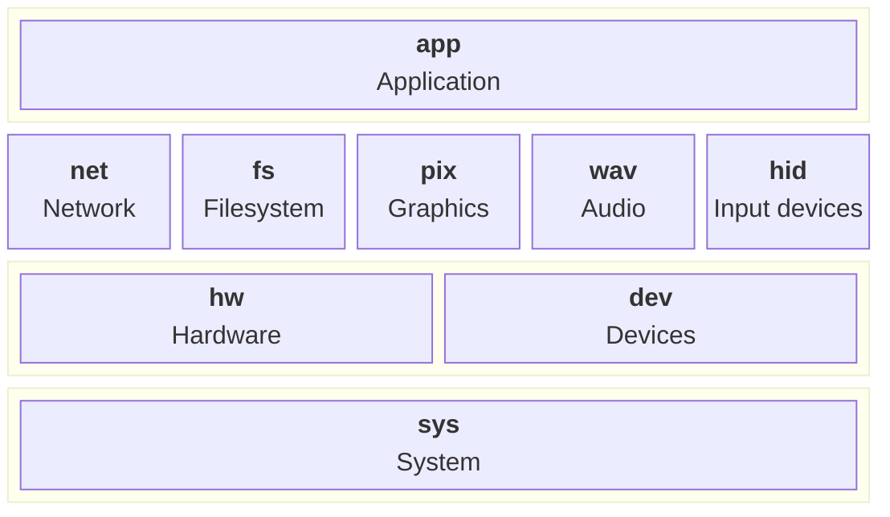

# picofuse

## Motivation

Picofuse is a software system for hardware-independent development of small
event-driven applications. It provides a common interface for hardware
peripherals and a build system that abstracts away the details of the
underlying hardware. There are a variety of modules which define the abstraction.



* `sys`: System-level functions.
* `hw` : Hardware for peripherals such as GPIO, I2C, SPI, etc.
* `dev` : Device implementation for specific components.
* `net`: Network stack for TCP/IP communication.
* `fs` : Filesystem abstraction for persistent storage.
* `pix`: Graphics library for drawing on displays.
* `wav`: Audio library for playing and recording sound.
* `hid`: Human Interface Device library for handling input devices, such as keyboards, button and mice, plus sensor readings.
* `app`: Application framework for event-driven programming.

A standalone, per-board "picofuse"
installation is built, together with its headers and `pkg-config` metadata,
installed under a plain directory prefix (e.g. `/opt/picofuse/<board>`).
A third party who only has that installed prefix - not this repository,
not the pico-sdk source tree -
can build a real `.elf` for that board using nothing but CMake, `pkg-config`
and the compiler toolchain, via the `picofuse_executable()` helper installed
alongside the prefix (see [`examples/helloworld`](examples/helloworld)):

```cmake
cmake_minimum_required(VERSION 3.20)
project(helloworld C)

include(/opt/picofuse/<board>/cmake/picofuse_executable.cmake)

picofuse_executable(
    NAME helloworld
    LIBRARIES picofuse-sys
    SOURCES helloworld.c
)
```

```sh
export PKG_CONFIG_PATH=/opt/picofuse/<board>/lib/pkgconfig
cmake -S . -B build
cmake --build build
```

The aim is that prototyping can be performed on a host computer, while deployment to the target hardware (such as Raspberry Pi or Pico)
is seamless and requires minimal changes to the code.

## Use

(under development)

* Download the picofuse library, which contains some supported boards, platforms and architectures.
* Use the API documentation and examine the samples.

## Development

The following sections assume you are wishing to adapt or otherwise develop the picofuse library.

### Requirements

* The `third_party/pico-sdk` submodule (pinned to pico-sdk 2.3.0), which
  itself pulls in further submodules - tinyusb, btstack, cyw43-driver, lwip,
  mbedtls. `make` initializes it recursively as part of `configure`, so
  there's no need to run `git submodule update` manually.
* An ARM GNU Toolchain (`arm-none-eabi-gcc` and friends) on `PATH`.
* CMake 3.20+.
* Python 3 (used by pico-sdk's own build for code generation and
  `picotool`).

Pico targets are self-contained, thanks to the Pico SDK. For host builds
(Linux, Darwin), the following dependencies enable optional features -
required ones are needed for the build to succeed at all, optional ones
are only needed to enable the corresponding feature:

| Dependency | macOS (Homebrew) | Debian/Raspberry Pi OS |
| --- | --- | --- |
| OpenSSL (required) | `brew install openssl@3` | `sudo apt install libssl-dev` |
| WPA Supplicant (optional, for WiFi support) | N/A | `sudo apt install libwpa-client-dev` |
| Mosquitto (optional, for MQTT support) | `brew install mosquitto` | `sudo apt install libmosquitto-dev` |
| USB (optional, for USB support) | `brew install libusb pkgconf` | `sudo apt install libusb-1.0-0-dev` |

### Build & Install

Use `make` to configure and build:

```sh
make
```

By default this builds for the host (`CMAKE_BUILD_TYPE=Release`) into `build/`.
Set `PICO_BOARD` to cross-compile for a specific board/chip combination, and
`CMAKE_BUILD_TYPE` to change the build type (e.g. `Debug`):

```sh
# Pico (RP2040)
make PICO_BOARD=pico BUILD_DIR=build-pico

# Pico W (RP2040 + CYW43 Wi-Fi/Bluetooth)
make PICO_BOARD=pico_w BUILD_DIR=build-pico_w

# Pico 2 (RP2350)
make PICO_BOARD=pico2 BUILD_DIR=build-pico2

# Pico 2 W (RP2350 + CYW43)
make PICO_BOARD=pico2_w BUILD_DIR=build-pico2_w

# Debug build
make CMAKE_BUILD_TYPE=Debug
```

`BUILD_DIR` defaults to `build` - set it to keep per-board build trees
separate, as above.

Install with:

```sh
make install
```

This builds and installs into `PREFIX` (defaults to `BUILD_DIR`, i.e.
`build/`). Combine with `PICO_BOARD` and `BUILD_DIR`/`PREFIX` to install a
per-board prefix, e.g.:

```sh
make PICO_BOARD=pico BUILD_DIR=build-pico PREFIX=/opt/picofuse/pico install
```

Installing produces, under the chosen prefix:

* `lib/libpicosdk.a`, `lib/libpicofuse_sys_pico.a`
* `include/` - every SDK module's headers merged into one consolidated tree,
  plus `picofuse/` and `runtime/`
* `lib/pkgconfig/picosdk.pc`, `lib/pkgconfig/picofuse_sys_pico.pc`
  (the latter `Requires: picosdk`, so pulling it in via `pkg-config` also
  pulls in picosdk's own flags)
* `lib/picosdk/src/` - the linker script fragments the `.pc` file's `Libs`
  point at

We'd like to provide pre-compiled per-board libraries (so consumers don't
need to build pico-sdk themselves) soon.

### Testing

Run the test suite with:

```sh
make test
```

Note: tests do not yet run when cross-compiling for a Pico board
(i.e. with `PICO_BOARD` set) - they currently only work for host builds.
It's envisaged that testing on Pico boards will require a Pico probe to
work.

## Examples

Example applications are available in the [`examples`](examples) folder
(currently `blink` and `helloworld`), showing how to build a real
application against an installed prefix.

## Documentation

API documentation is generated in Doxygen format:

```sh
make doc
```

This requires Docker, and writes the generated documentation into the
`doc` folder.

## Licensing

This project is licensed under the [Apache License 2.0](LICENSE). It
builds against third-party components with their own licenses (BSD,
MIT, Apache-2.0/GPL) - see [NOTICE.md](NOTICE.md) for details. Issues and pull
requests are welcome.
