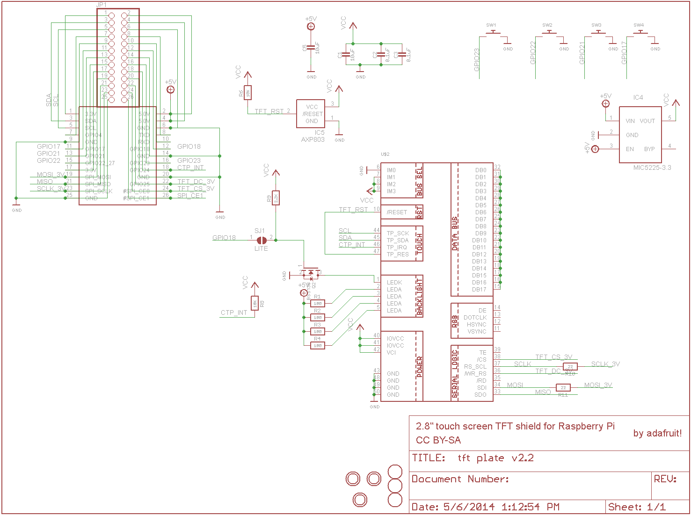

# Adafruit 2.8" PiTFT - Resistive Touch

2.8" display with 320x240 16-bit color pixels and a resistive touch overlay.
The PCB is silkscreened `STMPE610` (touch controller) and `ILI9341` (display
controller) - both share the Pi's primary SPI bus, each on its own
chip-select.

> The schematic below (`adafruit_products_pictpschem.png`) is for
> Adafruit's *capacitive* touch variant (FT6236 over I2C), not this board -
> kept here only until replaced with the correct one. Do not use it as a
> reference for this board's wiring.

## Pinout

Uses the hardware SPI pins (SCK, MOSI, MISO, CE0, CE1) plus GPIO24 and
GPIO25. GPIO18 is used for the display backlight control.

|Signal      |Pin|Pin|Signal      |
|------------|---|---|------------|
|        3.3V|  1|2  |5V          |
|            |  3|4  |5V          |
|            |  5|6  |GND         |
|            |  7|8  |            |
|         GND|  9|10 |            |
|            | 11|12 |LEDK        |
|            | 13|14 |GND         |
|            | 15|16 |            |
|GPIO24 (INT)| 17|18 |            |
|        MOSI| 19|20 |            |
|        MISO| 21|22 |GPIO25 (DC) |
|      SPICLK| 23|24 |CE0 (TFT_CS)|
|         GND| 25|26 |CE1 (TP_CS) |

Here is an overview of the pin functions:

* Power
  * 3.3V
  * 5V
  * GND
* Touch overlay (STMPE610 over SPI, CE1)
  * GPIO24 (interrupt pin from the touch controller)
  * GPIO25 (touch/display shared reset - not used by the touch driver alone)
* Backlight (PWM)
  * LEDK (backlight control pin)
* Display Controller (ILI9341 over SPI, CE0)
  * MISO (data line from the SPI bus, shared with the touch controller)
  * MOSI (data line to the SPI bus, shared with the touch controller)
  * SPICLK (clock line for the SPI bus, shared with the touch controller)
  * CE0 (chip select pin for the display controller)

## References

<https://github.com/adafruit/Adafruit-PiTFT-2.8-inch-Display-PCB>
